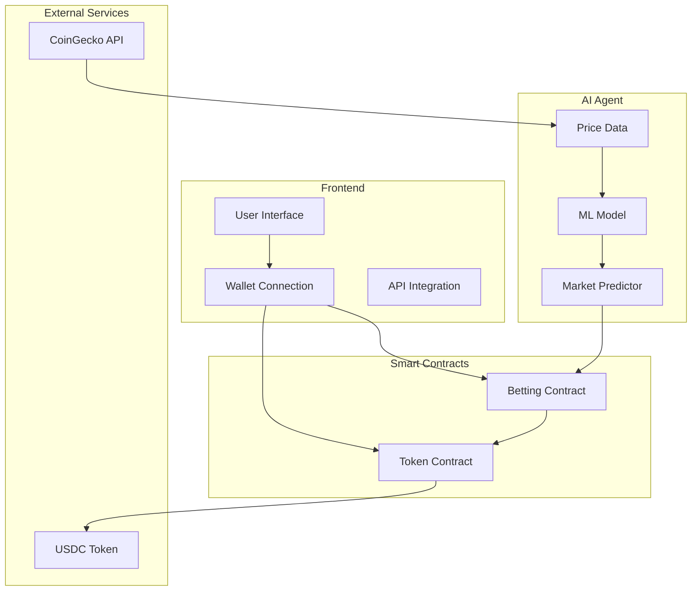
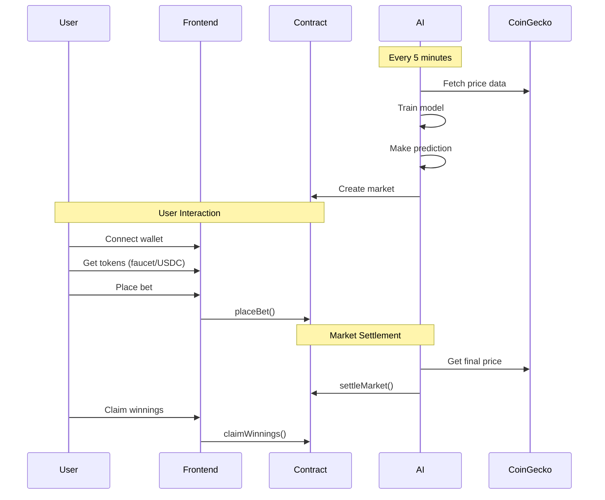
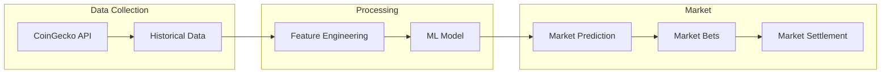
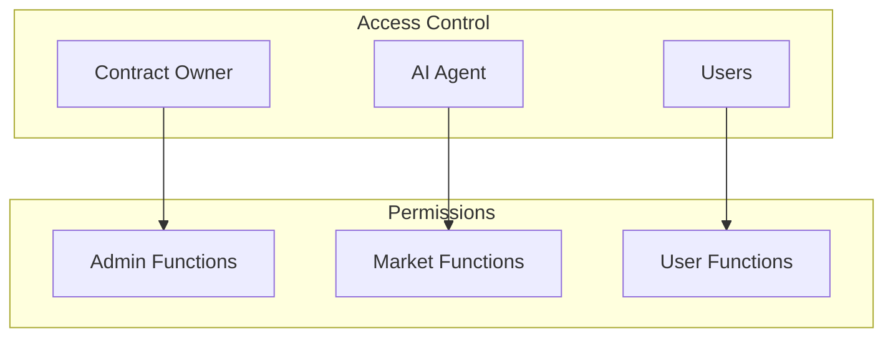

# Architecture

## System Overview

```mermaid
graph TB
    subgraph Frontend
        UI[User Interface]
        WC[Wallet Connection]
        API[API Integration]
    end

    subgraph Smart Contracts
        BC[Betting Contract]
        TC[Token Contract]
    end

    subgraph AI Agent
        PD[Price Data]
        ML[ML Model]
        MP[Market Predictor]
    end

    subgraph External Services
        CG[CoinGecko API]
        USDC[USDC Token]
    end

    UI --> WC
    WC --> BC
    WC --> TC
    BC --> TC
    PD --> ML
    ML --> MP
    MP --> BC
    CG --> PD
    TC --> USDC
```

## Component Interaction

```mermaid
sequenceDiagram
    participant User
    participant Frontend
    participant Contract
    participant AI
    participant CoinGecko

    Note over AI: Every 5 minutes
    AI->>CoinGecko: Fetch price data
    AI->>AI: Train model
    AI->>AI: Make prediction
    AI->>Contract: Create market

    Note over User,Contract: User Interaction
    User->>Frontend: Connect wallet
    User->>Frontend: Get tokens (faucet/USDC)
    User->>Frontend: Place bet
    Frontend->>Contract: placeBet()
    
    Note over AI,Contract: Market Settlement
    AI->>CoinGecko: Get final price
    AI->>Contract: settleMarket()
    User->>Frontend: Claim winnings
    Frontend->>Contract: claimWinnings()
```

## Data Flow

```mermaid
graph LR
    subgraph Data Collection
        CG[CoinGecko API]
        HD[Historical Data]
    end

    subgraph Processing
        FE[Feature Engineering]
        ML[ML Model]
    end

    subgraph Market
        MP[Market Prediction]
        MB[Market Bets]
        MS[Market Settlement]
    end

    CG --> HD
    HD --> FE
    FE --> ML
    ML --> MP
    MP --> MB
    MB --> MS
```

## Security Model

```mermaid
graph TB
    subgraph Access Control
        Owner[Contract Owner]
        AI[AI Agent]
        Users[Users]
    end

    subgraph Permissions
        Admin[Admin Functions]
        Market[Market Functions]
        User[User Functions]
    end

    Owner --> Admin
    AI --> Market
    Users --> User
``` 